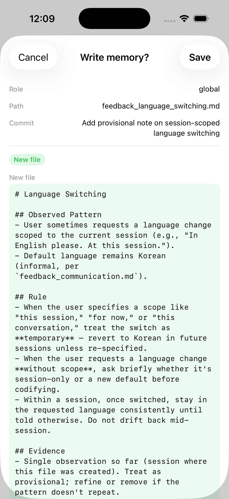
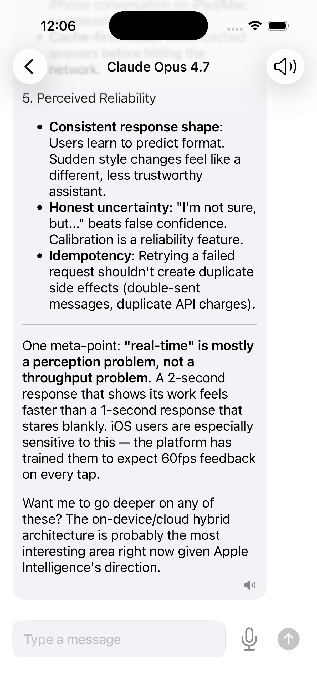

# NeuroRune

[](https://github.com/ty-kim/NeuroRune/actions/workflows/ci.yml)

Sessions die, memory carries on.

LLM과 나눈 대화를 — 음성이든 텍스트든 — GitHub에 동기화되는 개인 메모리로 바꾸는 iOS 앱.

## 화면

|  |  |
| --- | --- |
| 사용자가 직접 승인하는 메모리 쓰기 | 스트리밍 채팅과 음성 재생 |

## 개요

LLM 세션은 매번 0에서 시작한다. 컨텍스트가 초기화되고, 내린 결정이 흩어지고, 어제 나눈 대화가 사라진다. NeuroRune은 거친 대화를 정제된 메모리 파일로 바꿔 사용자 소유의 GitHub 저장소에 쌓고, 다음 세션으로 넘긴다.

수면 중 일어나는 기억 공고화와 같은 구조다 — 단기 경험을 장기 지식으로 옮기는 일을 AI 세션에 대해 한다.

BYOK(Bring Your Own Key) 앱이다. API 키는 사용자가 직접 넣고 Keychain에 보관하며, 바이너리에는 어떤 키도 포함하지 않는다.

여기서 다루는 문제는 특정 벤더에 묶이지 않는다. 스트리밍 응답, 영속 메모리, tool 호출, STT, TTS를 각각 client 경계 뒤에 두어 제공자를 갈아끼워도 앱 레이어를 다시 쓰지 않도록 했다. 현재 구성은 LLM에 Anthropic, STT에 Groq Whisper, TTS에 ElevenLabs다.

## 핵심

- 세션 단위 모델 선택·영속화·실패 처리를 갖춘 스트리밍 채팅
- GitHub에 두는 사용자 소유 메모리 — `read_memory` / `write_memory`, 쓰기 전 명시적 승인
- 제품 로직과 분리한 STT / TTS 클라이언트 기반 음성 입출력
- 최근 대화를 검토 가능한 메모리 제안으로 바꾸는 정제(consolidation) 플로우
- 품질 장치: Swift 6 strict concurrency, strict CI(SwiftLint + 빌드·테스트, 위 배지), 단위·UI 스모크 테스트, 다국어, 접근성
- 제공자 경계(`LLMClient`, `STTClient`, `SpeakerClient`)로 특정 모델·음성 벤더에 앱이 묶이지 않게 함

## 구현 현황

### 채팅 ✅
- [x] 스트리밍 LLM 연동 (Anthropic)
- [x] Keychain 자격증명 (저장/로드/삭제 + 초기화 UI)
- [x] 채팅 세션 영속화 (SwiftData, 대화 목록, 삭제)
- [x] 마크다운 렌더링 (swift-markdown-ui, 코드 블록 가로 스크롤)
- [x] 세션 단위 모델 선택 (모델 선택 시트)
- [x] OSLog 로깅 (network, keychain, llm, persistence)
- [x] 다국어 (ko, en, zh-Hans, zh-Hant, ja)
- [x] 접근성 (VoiceOver 레이블, Reduce Motion)
- [x] 에러 UI (배너 + shake + 401 알럿)
- [x] 앱 아이콘 (ᛗ Mannaz rune), 브랜드 컬러 (amber + dark navy)
- [x] 런치 스크린 (DarkNavy + Mannaz rune)
- [x] 단위 테스트 395개, Swift Testing + TCA TestStore
- [x] UI 스모크 테스트 3개 (총 398개)

### 메모리 ✅
- [x] GitHub 기반 메모리 동기화 (.global / .local role, PAT 인증)
- [x] 사용자 직접 편집 + 커밋 (MemoryEditView / MemoryCreateView)
- [x] 메모리 컨텍스트 주입 (MEMORY.md 자동 + `read_memory` tool 동적 로드)
- [x] tool 호출 투명성 UI (모델이 읽는 파일명을 칩으로 표시)
- [x] `write_memory` tool + 확인 모달 (role/path/commit/내용 → 사용자 승인)

### 음성·정제 ✅
- [x] STT 연동 (Groq Whisper)
- [x] TTS 연동 (ElevenLabs)
- [x] 정제 (최근 대화 + 메모리 수집 → LLM 제안 → 수락/거절 UI)

## 기술 스택

- Swift 6 Strict Concurrency
- SwiftUI
- SwiftData
- TCA (The Composable Architecture)
- URLSession (외부 네트워크 라이브러리 없음)
- AVFoundation
- swift-markdown-ui
- Keychain Services

## 아키텍처

```text
SwiftUI Views
    ↕
TCA Reducers / State
    ↕
Client 경계
    ├─ LLMClient
    ├─ STTClient
    ├─ SpeakerClient
    ├─ GitHubClient
    └─ KeychainClient
    ↕
제공자별 구현
```

현재 연결:

- LLM: Anthropic
- STT: Groq Whisper
- TTS: ElevenLabs
- 메모리 동기화: GitHub REST API

음성 쪽 제공자는 개발 중 두 번 교체했다 — TTS는 Azure → ElevenLabs, STT는 Clova → Groq Whisper. 관리 콘솔 복잡도와 과금 구조, 한국어 인식 품질을 겪고 나서 내린 판단이다. 두 교체 모두 앱 레이어는 손대지 않았다. 경계가 함수 시그니처 하나(`STTClient.transcribe`, `SpeakerClient.synthesize`)뿐이라, 새 클라이언트 추가 → 설정 이관 → 메뉴 교체 → 구버전 제거 → 남은 저장 키 정리 순으로 나눠 진행했다.

## 요구 사항

- iOS 17+
- LLM API 키 (Anthropic)
- GitHub Personal Access Token (메모리 동기화)
- STT API 키 (Groq Whisper)
- TTS API 키 (ElevenLabs)

## 알려진 제약

- **Reducer와 Client 전반이 `nonisolated`다.** Swift 6의 MainActor 기본 격리 아래에서 이 프로젝트는 TCA 1.7+ 프로토콜 경로(`Reducer` + `var body` + `WithViewStore`)를 쓰고 `@Reducer` / `@ObservableState` 매크로 경로는 채택하지 않았다. 대가는 Client·Reducer 계층에 `nonisolated`를 명시해야 하고, Observation API를 못 쓰며, `WithViewStore`/`ViewStore` 계열 deprecation 경고 40건이 빌드에 남는다는 것이고, 얻은 것은 격리를 푸는 예외 없이 strict concurrency를 켠 채로 간다는 것이다. CI에는 `-skipMacroValidation`이 필요하다 — 없으면 SwiftPM이 매크로 신뢰 프롬프트에서 멈춘다. TCA 2.0 시점에 다시 판단한다.

- **마크다운 렌더링에 상한이 없다.** 응답을 길이·깊이 제한이나 렌더 타임아웃 없이 MarkdownUI에 그대로 넘긴다. 1인용 BYOK 앱이라 위협 모델은 좁지만(본인 기기에서 본인이 부른 응답), 병적으로 긴 응답은 UI를 멈출 수 있다. `effort`를 낮춰 응답 길이를 제한하고, swift-cmark 파서 CVE를 지켜보는 것으로 다룬다.

## AI 사용 범위

코딩 에이전트(Claude Code, Codex)로 작성했고, 규칙은 [`CLAUDE.md`](CLAUDE.md)에 고정했다 — TDD 사이클, structural/behavioral 커밋 분리, Phase 종료 시 테스트 품질 감사. 이슈는 같은 코드를 두 모델에 각각 물려 무엇을 잡아내는지 비교해서 뽑았고, 채택과 판단과 커밋은 직접 했다. 계획과 범위 결정은 대화 기록이 아니라 [`docs/`](docs/)에 둔다 — 그래야 왜 그렇게 바꿨는지가 세션과 함께 사라지지 않는다.

## 만든 배경

깁슨의 사이버스페이스가 데이터를 위한 공간이라면, cogspace는 사고를 위한 공간이다. 사람과 AI의 추론이 매 세션 처음부터 다시 시작하지 않고 시간을 가로질러 이어지는 쪽. NeuroRune은 그 생각을 모바일 앱으로 옮긴 것이다.

메모리 모델은 *Infinity Blade*(Epic Games, 2010)에서 빌려왔다. 한 세대가 배운 것을 다음 세대가 물려받는 구조인데, 여기서 세대는 다음 모델 세션이고 물려받는 것은 사용자가 소유한 메모리다.

## 문서

- [`docs/plan.md`](docs/plan.md) — 작업을 끌고 간 Sprint·Phase 분해
- [`docs/plan-chat-scroll-redesign.md`](docs/plan-chat-scroll-redesign.md) — 스크롤 문제 하나에 대한 다섯 번의 시도와 각각을 폐기한 근거
- [`todo.md`](todo.md) — 남은 작업과 범위 판단
- [`CLAUDE.md`](CLAUDE.md) — 에이전트가 따르는 개발 규칙 (TDD, Tidy First, 테스트 감사)

## 라이선스

[MIT](LICENSE)
